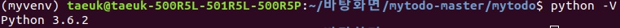
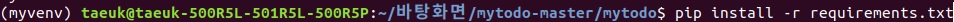
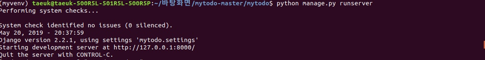

# mytodo  
Todo web application which is implemented with Python, Django  
  
## language and framework
  
python==3.6.2  
  
Django==2.2.1  
pytz==2019.1  
sqlparse==0.3.0  
  
## How to run the application  
### Linux  
mytodo 프로젝트 폴더내에 manage.py가 있는 폴더로 이동한다.  
  
#### pip install -r requirements.txt  
명령어를 통해서 위에서 언급한 프레임워크를 설치한다.  

이후 __pip freeze__ 명령어를 통해서 해당 프레임워크가 잘 설치되었는지 확인 후  
 
#### python manage.py runserver  
명령어를 통해서 장고 로컬 서버를 실행한다.  
  
그리고 웹 브라우저를 통해 __127.0.0.1:8000__ 주소로 들어가서 어플을 실행할 수 있다.  
  
## Guide  
먼저 웹 어플리케이션으로 접속하면
  
이러한 메인화면이 뜬다.  
  
서비스를 이용하고 싶다면 회원가입을 먼저하고 이용할 수 있으며,     
  
이미 회원가입이 되어 있다면 로그인 이후 이전의 todo에 대해서 서비스를 이용할 수 있다.  
  
메인 화면에서 하단의 todo추가하기 버튼을 통해 해당 폼을 통해서 새로운 todo를 작성할 수 있다.
  
Todo를 클릭하면 세부적인 todo들이 있으며 세부적인 todo들을 모두 체크하고 check 버튼을 누를 경우  
Done으로 해당 Todo가 옮겨지게 된다.  
그리고 수정 버튼을 통해서 Todo 제목, 세부적인 todo, Due date, 그리고 우선순위들을 수정할 수 있다.  
또한 삭제 버튼을 통해 해당 Todo를 삭제할 수 있도록 하였다.
  
Todo를 작성하거나 수정할 때 정했던 Due date를 초과시 Overdue로 Todo가 옮겨지며 상단 우측에는 알림이 제공된다.  

